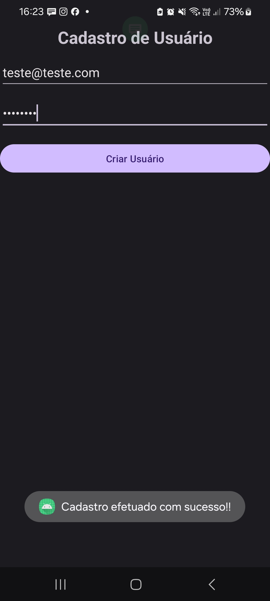
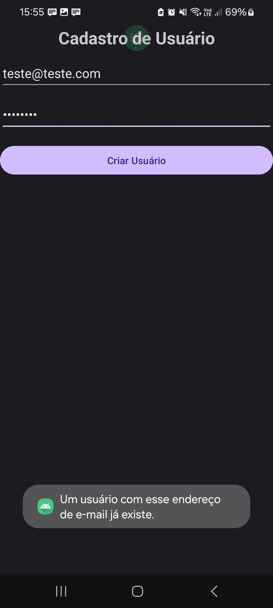

# Projeto Final - Curso a Distância: Android – Autenticação Firebase

## Descrição

Este repositório contém o projeto final do curso "Android – Autenticação Firebase", ministrado pelo Professor Edson Carlos Baptista e disponibilizado pela CETEC/CPS. 

O projeto consiste em uma aplicação Android completa, desenvolvida como exemplo prático para os alunos do curso. 

## Conteúdo

Este repositório inclui os seguintes arquivos:

* **Código fonte:** Código da aplicação Android, incluindo as classes, layouts, recursos e outras partes do projeto.
* **Recursos:** Arquivos de imagens, layouts, strings e outros recursos utilizados pela aplicação.

## Prints:
| Mensagem | Notificação |
|---|---|
|  |  |
| Mensagem de Erro | Notificação de Erro |
|  |  |

* **Firebase:** 
* 

## Observações

* Este projeto é um exemplo de entrega para o curso e serve como referência para os alunos.
* É recomendado que os alunos explorem o código fonte.
* Este repositório não contém os materiais didáticos do curso. 

## Contribuições

Este repositório está aberto a contribuições. Sinta-se à vontade para enviar correções, melhorias ou novas funcionalidades.
